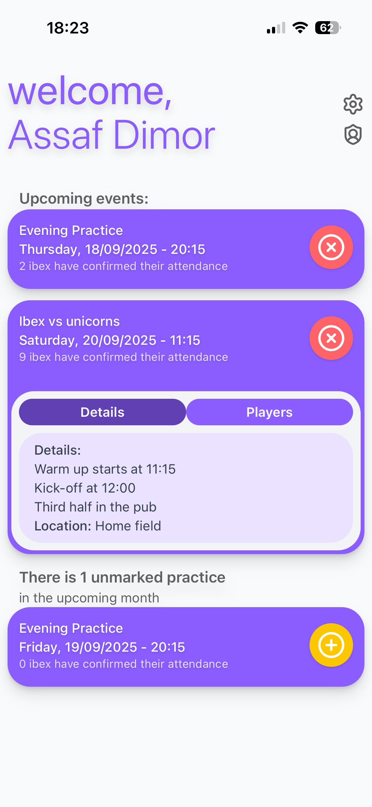
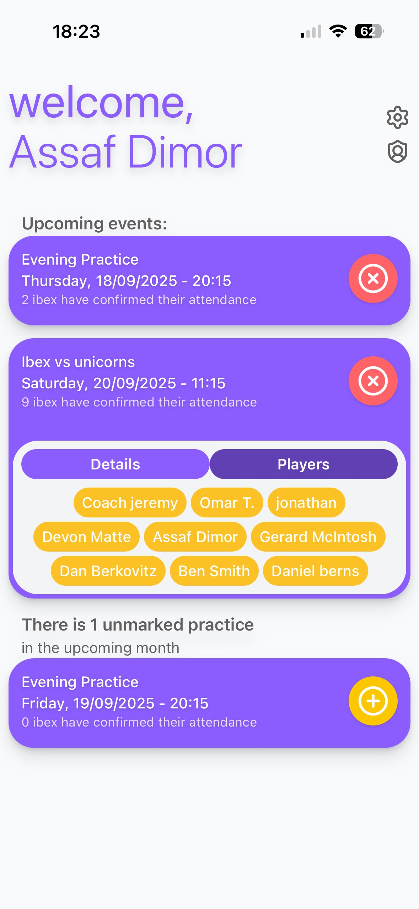
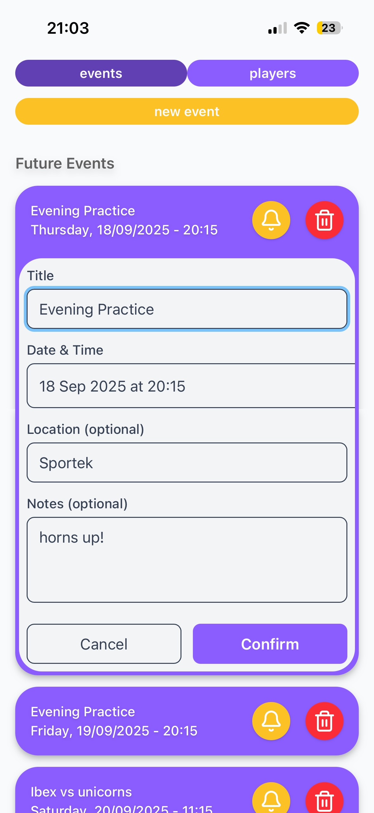
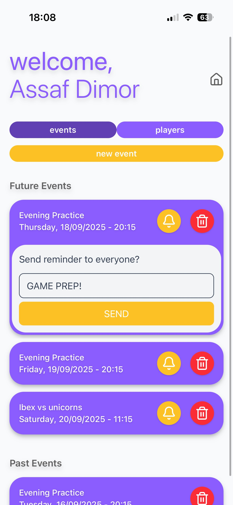
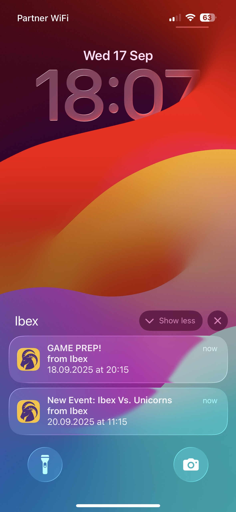

# Ibex Attendance Demo

This is lightweight web app (PWA) that I built to help manage my rugby team’s events and attendance.  
We have been doing it for a while as WhatsApp polls and i felt like we could use a more designated approach, that won't get lot in the grou chat.

##  Features
- View upcoming events
- Mark attendance to upcoming events
- Track number of attendees per event
- Recieve push notifications for New events and updates

##  Admin Tools 
- view, add, and edit events
- Send custom notifications to the team

## Tech Stack
- React + Vite for frontend development
- Tailwind CSS for styling
- Firebase for auth + storage +FCM push managing

### Players DashBoard
  
### Admins DashBoard
 
### notifications

